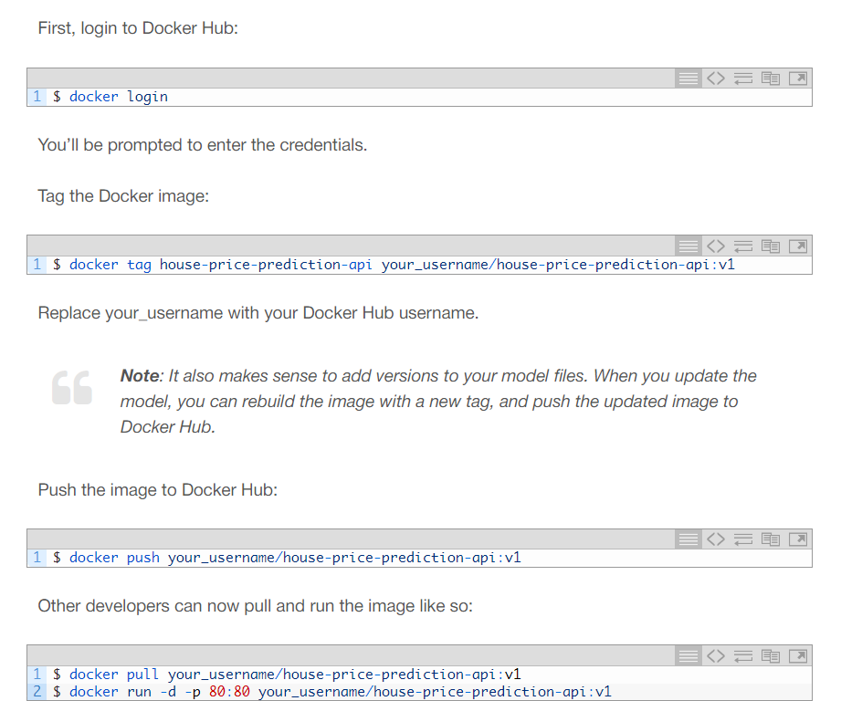

# Deploying a basic ML model
 This is a guide to deploying a basic machine learning model using docker and FastAPI

Note this guide is based on a combination of resources used, attached at the bottom of the file.

1. create these files in a project:
    1. **main.py**            # FastAPI code for prediction API**
    2. **__init__.py**        # Empty file
    3. **model_training.py**        # Script to train and save the model
    4. **requirements.txt**        # Dependencies for the project
    5. **Dockerfile**              # Docker configuration
2. Run this in the terminal of your project
    ```bash
    pip3 install pandas scikit-learn fastapi uvicorn
    ```
3. after training the model: have this in your model_training.py:
    
   1. Create a 'model' folder to save the trained model
    
   2. os.makedirs('model', exist_ok=True)
    
   3. Save the trained model using pickle
    
   4. ```python
      with open('model/linear_regression_model.pkl', 'wb') as f:
         pickle.dump(model, f)
      ```
    
4. Run: python3 model_training.py
5. create a code like this in main.py:
     
    ```python
    # app/main.py
    from fastapi import FastAPI
    from pydantic import BaseModel
    import pickle
    import os
    
    # Define the input data schema using Pydantic
    class InputData(BaseModel):
        MedInc: float
        AveRooms: float
        AveOccup: float
    
    # Initialize FastAPI app
    app = FastAPI(title="House Price Prediction API")
    
    # Load the model during startup
    model_path = os.path.join("model", "linear_regression_model.pkl")
    with open(model_path, 'rb') as f:
        model = pickle.load(f)
    
    @app.post("/predict")
    def predict(data: InputData):
        # Prepare the data for prediction
        input_features = [[data.MedInc, data.AveRooms, data.AveOccup]]
        
        # Make prediction using the loaded model
        prediction = model.predict(input_features)
        
        # Return the prediction result
        return {"predicted_house_price": prediction[0]}
    
    ```
    
    
    
6. In the Dockerfile, write this code:
    
    ```dockerfile
    # Use Python 3.12 as the base image
    FROM python:3.12-slim
    
    # Set the working directory inside the container
    WORKDIR /code
    
    # Copy the requirements file
    COPY ./requirements.txt /code/requirements.txt
    
    # Install the Python dependencies
    RUN pip install --no-cache-dir --upgrade -r /code/requirements.txt
    
    # Copy the app folder into the container
    COPY ./app /code/app
    
    # Copy the model directory (with the saved model file) into the container
    COPY ./model /code/model
    
    # Expose port 80 for FastAPI
    EXPOSE 80
    
    # Command to run the FastAPI app with Uvicorn
    CMD ["uvicorn", "app.main:app", "--host", "0.0.0.0", "--port", "80"]
    
    ```
    
7. Download Docker for windows from google and complete the execution steps said by the wizard. Make a docker account.
8. Add docker as an extension in your IDE. <you can chatgpt this part>
9. Create a **requirements.txt** file listing all dependencies
10. Install cURL
    1. https://curl.se/windows/
    2. Install the package relevant to you
    3. unzip the downloaded folder
    4. open the bin folder, it should have an application there. Copy the path to the bin folder (NOT THE APPLICATION, JUST THE BIN FOLDER)
    5. Add this bin folder to your environment variables
    6. open windows powershell and run : curl —version 
11. Run: 
```bashdocker build -t house-price-prediction-api .```
12. Run: 
```bash docker run -d -p 80:80 house-price-prediction-api```
13. Now your port 80 is available to use, using fastAPI you can now use the model to make predictions about the housing prices.
14. run this on powershell:

```bash
$uri = "http://127.0.0.1:80/predict"
$body = @{
    MedInc = 3.5
    AveRooms = 5.0
    AveOccup = 2.0
}
Invoke-RestMethod -Uri $uri -Method Post -Body ($body | ConvertTo-Json) -ContentType "application/json"
```

This should return a response with the predicted house price, like this:

{
"predicted_house_price": 2.3248705765077062
}



Note: Anyone with access to your Docker Hub repository can now pull the image and run the container.


https://machinelearningmastery.com/a-practical-guide-to-deploying-machine-learning-models/

https://www.youtube.com/watch?v=bi0cKgmRuiA
